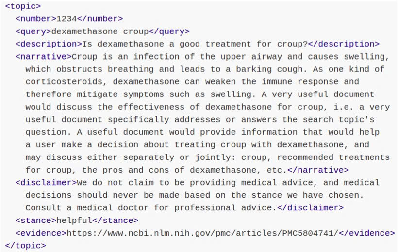
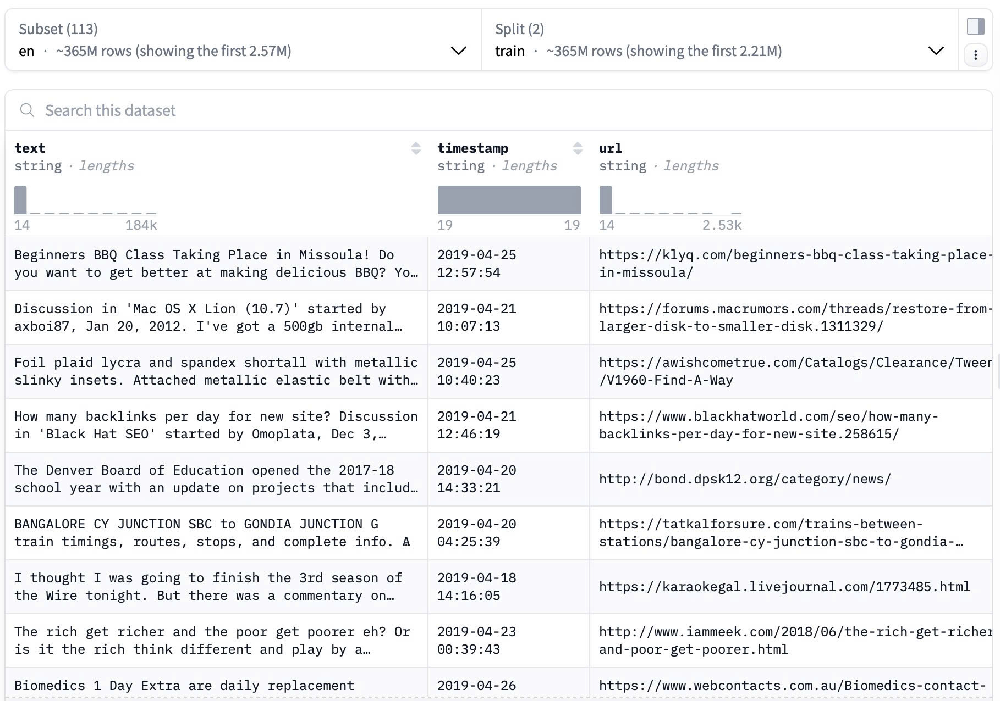

# TREC Health Misinformation Datasets

## Overview
- Designed to test retrieval systems on health queries where incorrect info can harm decisions.
- Components:
    - **Topics/Queries (50 total)** with fields: query text, description (question), narrative (criteria), stance (helpful/unhelpful), evidence URL
    - **Qrels**: 0-3 grades per doc-query pair
    - **Corpus**: C4 "en.noclean-tr" extracts from Common Crawl
- Sample: A TREC 2021 Health Misinformation Track topic (Topic 101)
<!--  -->

    

- Integrate to C4 datasets which contain the *document* pool
    - fields like: doc_id, text, url, and timestamp

    | Aspect      | c4/en-noclean-tr              | c4/en-noclean-tr/trec-misinfo-2021        |
    | ----------- | ----------------------------- | ----------------------------------------- |
    | Content     | ~1B docs only                 | Docs + 50 queries + qrels ir-datasets​    |
    | Use Case    | Corpus for indexing/embedding | Misinfo retrieval benchmarking citius​    |
    | ir_datasets | docs_iter()                   | queries_iter(), qrels_iter() ir-datasets​ |

## C4 in Hugging Face 
- A colossal, cleaned version of Common Crawl's web crawl corpus. Based on [Common Crawl dataset](https://commoncrawl.org).
- This is the processed version of Google's C4 dataset
- They provided five variants of the data: en, en.noclean, en.noblocklist, realnewslike, and multilingual (mC4).

| Variant        | Size  | Cleaning Description  |
| -------------- | ----- | ---------------------------------------------------------------- |
| en             | 305GB | Standard: Heavily filtered for quality—removes duplicates, offensive content, badwords/blocklist terms, non-natural language. Used for T5 training.|
| en.noclean     | 2.3TB | Minimal cleaning: No quality filters beyond language detection; includes raw, noisy web text (largest due to unfiltered volume). |
| en.noblocklist | 380GB | Like "en" but skips blocklist/badwords filter (e.g., no removal based on lists like LDNOOBW obscene words repo). Retains potentially offensive docs. |
| realnewslike   | 15GB  | Strictest: Subset resembling news articles—high-quality, structured content only (smallest, focused on journalistic style). |

- Samples: 

## Source Types
- Source: lacking explicit source type labels, but categorization is analysed 
    - URL Domain Tracking: News sites (e.g., nytimes.com) vs. blogs (e.g., wordpress.com) vs. forums (e.g., reddit.com)
    - Text patterns: scientific (mentions studies/journals), commercial (product ads), social media (short posts/hashtags), or forums (Q&A style)
    - Previous analysis [[7]](https://arxiv.org/pdf/2104.08758) regarding Internet domains and Websites

- Suggestion

| Category     | Example Domains                  | Prevalence in C4 | Relevance to Misinfo Track                  |
| ------------ | -------------------------------- | ---------------- | ------------------------------------------- |
| News/Media   | cnn.com, bbc.co.uk               | High             | Often judged for correctness citius​        |
| Academic/Gov | nih.gov, pubmed.ncbi.nlm.nih.gov | Low              | High credibility baseline ir-datasets​      |
| Blogs/Forums | wordpress.com, reddit.com        | Medium           | Prone to unverified claims knowingmachines​ |
| Commercial   | amazon.com, health sites         | Medium           | Potential misinformation sources citius​    |

# REFERENCES
1. [TREC Health Misinformation Track](https://trec-health-misinfo.github.io)
2. [Dataset structure](https://ir-datasets.com/c4.html)
3. [Overview of TREC 2021](https://trec.nist.gov/pubs/trec30/papers/Overview-2021.pdf)
4. [Dataset](https://huggingface.co/datasets/allenai/c4)
5. [TREC 2021 Health Misinformation Dataset](https://catalog.data.gov/dataset/2021-health-misinformation-dataset)
6. [CiTIUS at the TREC 2021 Health Misinformation Track](https://citius.gal/static/de2eca793e548af15c1a5d2f733febf5/citius_at_trec_2021_health_misinfo_20220209103404708_1eee6d0251.pdf)
7. [Documenting Large Webtext Corpora: A Case Study on the Colossal Clean Crawled Corpus](https://arxiv.org/pdf/2104.08758)