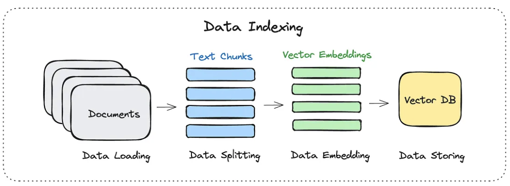

# RAG PIPELINE IMPLEMENTATION

## 1. Data Indexing

- Data loading: This involves importing all the documents or from an extracted doc file `../dataset/extracted_docs.jsonl`.
- Data Splitting: Splits documents into smaller chunks (600 characters with 100 overlap).
- Data Embedding: Initializes Ollama embeddings using the model specified in environment variables.
- Data Storing: Adds all document chunks to the vector database. 
### 1.1. Vector database
- `Chroma`: open-source vector db built for storing and querying embeddings used in ML and AI applications
- Integrations: LangChain, LlamaIndex, and major ML frameworks
- APIs: creating collections, adding documents and performing similarity searches via cosine or Euclidean distance
- Use cases: semantic document retrieval, chatbots
- Support: Python, Javascript

### 1.2. Embedding model
- `nomic-embed-text` default choice in [Ollama](https://ollama.com/search?c=embedding).
