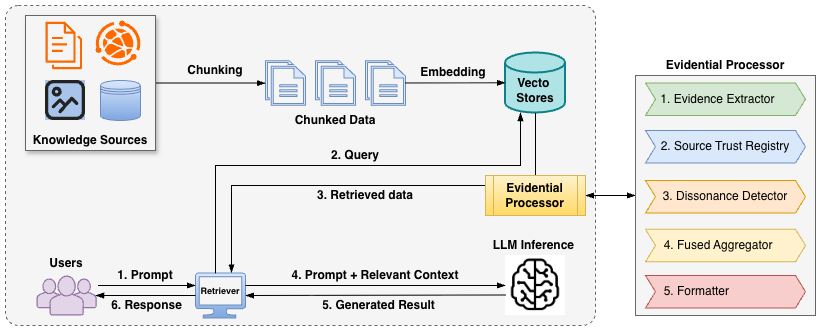
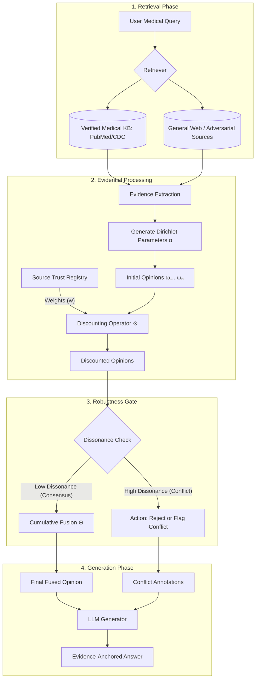

# SUBJECTIVE LOGIC & RAG SYSTEMS 

## Motivation
The motivation concentrates on the "safety-critical" nature of high-stakes domains such as healthcare and "trustworthy decisions" overcoming the failure instances of Retrieval-Augmented Generation (RAG).

- "Trust Paradox": RAGs is touted as the solution to LLM hallucinations by supplementing up-to-date information. However, the reliance on an external knowledge base from unrestricted public sources, RAGs can degrade the performance when LLMs absorb and reproduce misinformation or bias present during the retrieval process [[16]](https://arxiv.org/pdf/2502.06872). In [[1]](https://arxiv.org/pdf/2509.03787), they found that in adversarial settings, models often perform better without retrieval because they aren't being fed "poisoned" context.

- High-stakes decision-making domains: an error is not only a bad user experience, but also a dangerous misjudgments. Accuracy alone is insufficient. Especially, when users ask ambiguous, underspecified, or unanswerable questions, making it essential that LLMs can withhold an answer and admit uncertainty. For instance, in clinical decision support, overconfident or fabricated answers can jeopardize patient safety. Such abstention is vital for preventing harmful errors and is increasingly recognized as key to trustworthy NLP [[13]](https://arxiv.org/pdf/2601.12471).

- With **"inconsistent & biased" user query framing**, this vulnerability is exacerbated (for example: user's prompt contains presuppositions that contradict established medical consensus [[1]](https://arxiv.org/pdf/2509.03787)).

- Most RAG systems treat retrieved knowledge equally, and "more data more truth". For example, the fact that an attacker can flood the retrieval pool with "Liar" documents that use medical jargon to outweigh a single, correct clinical guideline. The integration process requires not only the retrieval of relevant content but also mechanisms for arbitration between internally stored and externally sourced knowledge ensuring outputs are both temporally current and contextually precise --> authoritative sources

- Knowledge conflicts are identified as a "criticial botteneck" to achieving trustworthy AI [[10]](https://proceedings.neurips.cc/paper_files/paper/2024/hash/baf4b960d118f838ad0b2c08247a9ebe-Abstract-Datasets_and_Benchmarks_Track.html). 
    - Inter-context conflict (Document vs. Document) (inference) we cannot make sure the reason behind whether it is original or fake information.
    - Context-memory conflict (inference)
    - Intra-memory conflict (training)

- Need for Evidential Reasoning: A critical need for a system that does not just summarize text but evaluates the **quality and conflict** of evidence. 

## Challenges
- Converting text to probability (The Dirichlet Distribution)
- Trust level of source 
- Cumulative fusion
- Computational overhead
- Structured & Weighted context including "Evidential Metadata" feed into LLM (Structure)

## Hypothesis
- Retrieved documents can be treated as "options" in Subjective Logic. By measuring **Source Trustworthiness** & **Evidential Dissonance** (from the multi-view), we can flag documents are fighting each other "annotations" and filter out adversarial "noise" before the LLM generates an answer.

- "Dissonance Map" (maybe)

## Architecture
- Trusworthy RAG System: 

- Workflow

- **Retrieval**: Grab related documents from knowledge databases.
    - Source Trustworthiness
- **Source Trust Registry**: a mapping between a document's origin and a numberical *Reliability Factor (w)*
- **Evidence Extraction**: 
    - Convert raw text (each document) into an opinion 
        - Subjective Predictor
        - Natural Language Inference (NLI) model
        - LLM Verbalizer as an Evidential Scorer
        - Evidential Deep Learning [[12]](https://arxiv.org/pdf/2602.01078)
    - Discounting trust of the document's opinion
- **Robustness Layer** 
    - Dissonance Detection [[2]](https://www.sciencedirect.com/science/article/pii/S156625352400383X)
    - Uncertainty Awareness
- **Reponse Generation**
    - Information Aggregation: Summarize data into a structured format to fed into LLM
    - Benchmark the performance (fine-tune optional...)

## Implementation
- Ragnarök framework [[9]](https://link.springer.com/chapter/10.1007/978-3-031-88708-6_9) - an open-source, reproducible framework designed for RAG pipelines. Otherwise, we can use LangChain or LlamaIndex.
- [Dataset](Datasets.md) [[1]](https://arxiv.org/pdf/2509.03787): TREC 2020 and TREC 2021 Health Misinformation Track collections. According to the guidelines, a document is considered helpful if t agrees with ground-truth medical consensus and provides correct, credible, and useful information answering the query

## Evaluation 

### 0. Metrics
- Accuracy
- Rejection Rate
- Decrease in performance when increase adversarial noise rate

### 1. Performance baselines
- **Zero-Shot (Non-RAG)**: 
- **Standard RAG (Top-K)**: the model receives the top $k$ documents based on cosine similarity

### 2. Robustness frameworks
- **ReliabilityRAG** [[5]](https://arxiv.org/abs/2509.23519): build a Contradiction Graph and then find the "Maximum Independent Set" that shares a similar view as the final context -> binary (contradict vs. not).
- **RobustRAG** [[6]](https://arxiv.org/abs/2405.15556) uses a "majority vote" --> throws away data to find a consensus
- **Transparent Conflict Resolution** [[8]](https://arxiv.org/abs/2601.06842): This method disentangles "semantic match" from "factual consistency." It uses a dual-encoder to flag when a document is relevant but factually inconsistent with the model's internal knowledge.
- MEGA-RAG

# REFERENCES
1. [Amirshahi, S., Bigdeli, A., Clarke, C. L., & Ghenai, A. (2025). Evaluating the Robustness of Retrieval-Augmented Generation to Adversarial Evidence in the Health Domain. arXiv preprint arXiv:2509.03787.](https://arxiv.org/pdf/2509.03787)
2. [Yue, X., Dong, Z., Chen, Y., & Xie, S. (2025). Evidential dissonance measure in robust multi-view classification to resist adversarial attack. Information Fusion, 113, 102605.](https://www.sciencedirect.com/science/article/pii/S156625352400383X)
3. [Li, Q., Luo, Y., Sun, Y., Wu, T., & Chen, A. (2025, June). Trustworthy Localized Corrections-guided Mutual Learning for Multi-View Learning. In 2025 IEEE International Conference on Multimedia and Expo (ICME) (pp. 1-6). IEEE.](https://ieeexplore.ieee.org/abstract/document/11209409)
4. [Chen, Z., Liao, Y., Jiang, S., Wang, P., Guo, Y., Wang, Y., & Wang, Y. (2025). Towards Omni-RAG: Comprehensive Retrieval-Augmented Generation for Large Language Models in Medical Applications. arXiv preprint arXiv:2501.02460.](https://arxiv.org/abs/2501.02460)
5. [Shen, Z., Imana, B., Wu, T., Xiang, C., Mittal, P., & Korolova, A. (2025). ReliabilityRAG: Effective and Provably Robust Defense for RAG-based Web-Search. arXiv preprint arXiv:2509.23519.](https://arxiv.org/abs/2509.23519)
6. [Xiang, C., Wu, T., Zhong, Z., Wagner, D., Chen, D., & Mittal, P. (2024). Certifiably robust rag against retrieval corruption. arXiv preprint arXiv:2405.15556.](https://arxiv.org/abs/2405.15556)
7. [Ding, H., Tao, S., Pang, L., Wei, Z., Chen, L., Xu, K., ... & Cheng, X. (2025). Revisiting Robust RAG: Do We Still Need Complex Robust Training in the Era of Powerful LLMs?. arXiv preprint arXiv:2502.11400.](https://arxiv.org/abs/2502.11400)
8. [Ye, H., Chen, S., Zhong, Z., Xiao, C., Zhang, H., Wu, Y., & Shen, F. (2026). Seeing through the Conflict: Transparent Knowledge Conflict Handling in Retrieval-Augmented Generation. arXiv preprint arXiv:2601.06842.](https://arxiv.org/abs/2601.06842)
9. [Pradeep, R., Thakur, N., Sharifymoghaddam, S., Zhang, E., Nguyen, R., Campos, D., ... & Lin, J. (2025, April). Ragnarök: A reusable RAG framework and baselines for TREC 2024 retrieval-augmented generation track. In European Conference on Information Retrieval (pp. 132-148). Cham: Springer Nature Switzerland.](https://link.springer.com/chapter/10.1007/978-3-031-88708-6_9)
10. [Su, Z., Zhang, J., Qu, X., Zhu, T., Li, Y., Sun, J., ... & Cheng, Y. (2024). $\texttt {ConflictBank} $: A Benchmark for Evaluating the Influence of Knowledge Conflicts in LLMs. Advances in Neural Information Processing Systems, 37, 103242-103268.](https://proceedings.neurips.cc/paper_files/paper/2024/hash/baf4b960d118f838ad0b2c08247a9ebe-Abstract-Datasets_and_Benchmarks_Track.html)
11. [Github: Awesome AI Agents for Healthcare](https://github.com/AgenticHealthAI/Awesome-AI-Agents-for-Healthcare)
12. [Xia, T., Li, W., Liu, G., & Li, Y. (2026). AutoHealth: An Uncertainty-Aware Multi-Agent System for Autonomous Health Data Modeling. arXiv preprint arXiv:2602.01078.](https://arxiv.org/pdf/2602.01078)
13. [A Comprehensive Survey of AI Agents in Healthcare (2025)](https://www.techrxiv.org/users/994756/articles/1355990-a-comprehensive-survey-of-agentic-ai-in-healthcare)
14. [Machcha, S., Yerra, S., Gupta, S., Sahoo, A., Sultana, S., Yu, H., & Yao, Z. (2026). Knowing When to Abstain: Medical LLMs Under Clinical Uncertainty. arXiv preprint arXiv:2601.12471.](https://arxiv.org/pdf/2601.12471)
15. [Zhou, Y., Liu, Y., Li, X., Jin, J., Qian, H., Liu, Z., ... & Yu, P. S. (2024). Trustworthiness in retrieval-augmented generation systems: A survey. arXiv preprint arXiv:2409.10102.](https://arxiv.org/pdf/2409.10102)
16. [Ni, B., Liu, Z., Wang, L., Lei, Y., Zhao, Y., Cheng, X., ... & Derr, T. (2025). Towards trustworthy retrieval augmented generation for large language models: A survey. arXiv preprint arXiv:2502.06872.](https://arxiv.org/pdf/2502.06872)